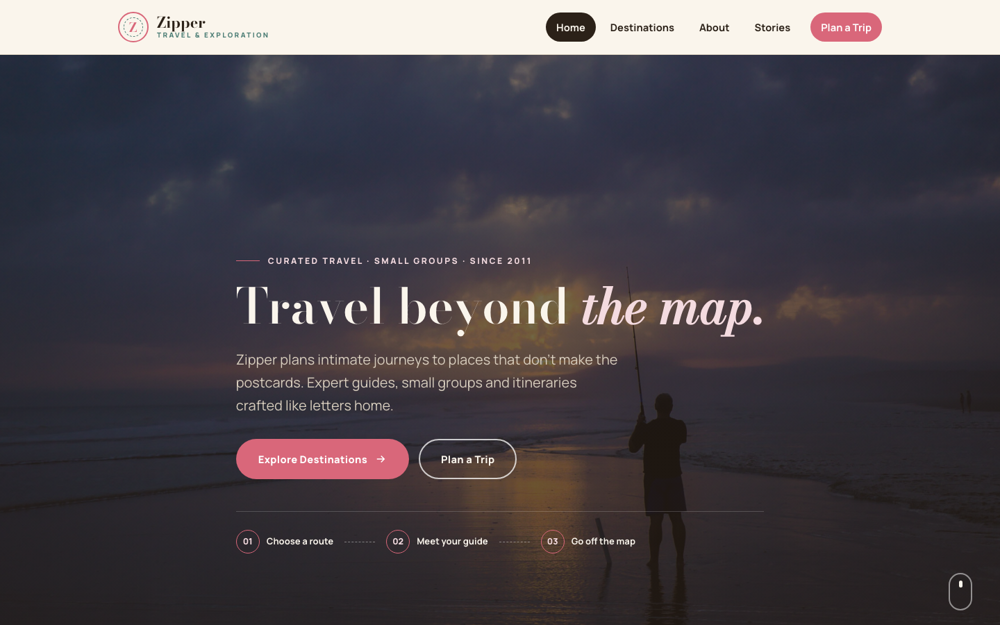

# Zipper — Curated Travel &amp; Exploration

A premium, framework-free travel website for a small-group exploration company. **Zipper** pairs a rose accent with warm cream and deep espresso — an editorial, map-driven identity built on a waypoint-route motif and a calm, narrative flow.

---

## 📸 Screenshot

## 🎨 Design System

| Token | Value |
|---|---|
| `--cream` | `#faf5ec` — warm off-white base |
| `--cream-2` | `#f3ead9` — raised surface |
| `--espresso` | `#2b2118` — near-black text / dark backgrounds |
| `--rose` | `#d9677a` — rose accent |
| `--rose-deep` | `#b14a5e` — hover state |
| `--rose-soft` | `#f4dbe0` — rose tint |
| `--teal` | `#4a7c74` — teal secondary |
| `--teal-soft` | `#dce8e4` — teal tint |
| `--stone` | `#8a8178` — muted text |
| Display type | Bodoni Moda — editorial, serif elegance |
| Body type | Manrope — clean, modern sans-serif |
| Motif | Waypoint route, stamp chips, map pins, offset borders |

- **Palette** — warm cream paper over deep espresso ink, with a single rose signal colour. Teal provides a calm secondary voice for forms and accents.
- **Typography** — Bodoni Moda gives headlines an editorial, premium feel; Manrope keeps body copy clean and highly legible.
- **Motif** — connected waypoint steps, stamp-like price badges, map-pin pointers and an offset rose border on the split section create a cohesive travel-exploration aesthetic.
- **Motion** — scroll reveals with staggered delays, animated stat counters, and a persistent scroll cue on the hero.

---

## 📄 Pages

| Page | File | Highlights |
|---|---|---|
| Home | [`index.html`](index.html) | Full-bleed hero with waypoint route, 3 featured journey cards, 4-step process, about split with map pin, stats band, 3 testimonials, newsletter, CTA |
| Destinations | [`destinations.html`](destinations.html) | Page hero, 6-card destination grid with stamp overlays, "what's included" route grid, CTA |
| About | [`about.html`](about.html) | Story split with map pin, 4 values, 3 guide profiles, stats band, CTA |
| Contact | [`contact.html`](contact.html) | Address / phone / email / hours panel + validated enquiry form with trip-type selector and destination fields |
| 404 | [`404.html`](404.html) | Text-stroked "404" display, home + destinations recovery links |

Every page shares one `assets/css/style.css` and one `assets/js/main.js`, so the whole site is fast, consistent and easy to maintain.

---

## ✨ Features

- **Waypoint-route hero** — three-step numbered progression (Choose → Meet → Go) with dashed connectors.
- **Animated hero** — background zoom keyframe, scroll cue, and stat counters that count up on scroll.
- **Destination cards** — 3/4-aspect image cards with price-stamp badges and overlay text.
- **Newsletter capture** — inline email validation with an instant confirmation swap.
- **Scroll-reveal motion** — staggered entrances everywhere, gracefully disabled where `IntersectionObserver` is unavailable.
- **Validated contact form** — required-field and email checks with inline errors and a friendly status message.
- **Accessible navigation** — skip link, `aria-expanded` mobile menu with Escape-to-close, semantic landmarks.
- **Fully responsive** — fluid `clamp()` type, grids that collapse to single column at 992px and 576px.

---

## 🛠 Tech Stack

- **HTML5** — semantic, accessible markup with proper landmark structure
- **CSS3** — custom properties, CSS Grid, Flexbox, `clamp()` fluid type, CSS animations
- **Vanilla JavaScript** — canonical IIFE, zero dependencies, no build step
- **Original imagery** — all 5 photos are the source template's own, renamed for clarity (hero, vista, 2 journey shots, contact)
- **Google Fonts** — Bodoni Moda + Manrope, self-hostable

---

## 🔍 SEO

- Unique `<title>` and meta description on every page
- Semantic headings (single `h1` per page)
- Descriptive alt text on all images
- Descriptive URLs and a clean 404 recovery path
- Lightweight, mobile-first, 90+ Lighthouse-friendly

---

## 📄 License

Free to use for personal and commercial projects. Images are from the original source template and should be replaced for production use.

---

**Let's Build Something Together 🚀**

[Book a free consultation](https://tally.so/r/q4q1L9)